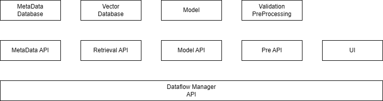

# Project Name: GrainTrace

## Version
0.1 MVP Draft

---

# 1. System Purpose

To identify and verify musical bows made from protected timber wood using image-based similarity embeddings and traceability records.

The system determines whether a queried bow matches an already registered bow in the database and retrieves ownership and contract information for traceability verification.

---

# 2. Inputs & Outputs

## 2.1 Inputs

- Bow images (Gray Scale)
- Registration metadata:
  - Owner information
  - Manufacturer information
  - Bow serial/reference ID
  - Wood type (optional)
- Query requests from API/UI
- Similarity threshold configuration

---

## 2.2 Outputs

- Embedding vector representation
- Top-k similar bow matches
- Similarity/confidence scores
- Match decision:
  - Registered Match
  - Possible Match
  - No Match
- Ownership and contract information
- Generated bow registration ID
- Query logs and traceability history

---

# 3. System Operation

1. User uploads a bow image through the UI or API
2. Image is preprocessed and validated
3. Model generates embedding vector representation
4. Retrieval system compares embedding against stored embeddings
5. Top matching bows are retrieved
6. Similarity threshold determines whether a valid match exists
7. Associated ownership and traceability records are retrieved
8. Results are returned to the user

---

# 4. Functional Requirements

The system shall:

- Accept uploaded bow images
- Generate embeddings from images
- Compare embeddings against stored database embeddings
- Retrieve top matching bows
- Return similarity scores
- Retrieve ownership traceability records
- Support registration of new bows
- Log query history

---

# 5. Non-Functional Requirements

- Fast retrieval response
- Scalable embedding storage
- Secure contract storage
- Consistent image capture conditions
- API availability
- Extensible architecture for future sensors

---

# 6. System Architecture

## High-Level Architecture

---

# 7. Component Description

## 7.1 UI

### Responsibilities
- Upload bow images
- Submit registration requests
- Submit retrieval/verification requests
- Display similarity results
- Display ownership and traceability information

### Communicates With
- Data Flow Manager API

### Inputs
- Bow images
- User metadata
- Registration requests

### Outputs
- Verification results
- Similarity scores
- Ownership information
- Registration response

### Technology
- Streamlit (MVP)

---

## 7.2 Data Flow Manager / Orchestrator

### Responsibilities
- Coordinate system workflows
- Route requests between services
- Manage registration pipeline
- Manage retrieval pipeline
- Handle response formatting
- Generate and manage shared bow IDs

### Communicates With
- UI
- Preprocessing & Validation API
- Model API
- Retrieval API
- Metadata API

### Inputs
- User requests
- Processed images
- Embeddings
- Retrieval results
- Metadata results

### Outputs
- API requests to internal services
- Final formatted responses

### Technology
- FastAPI

---

## 7.3 Preprocessing & Validation Service

### Responsibilities
- Validate uploaded images
- Enforce capture constraints
- Resize and normalize images
- Perform optional background removal
- Reject invalid or low-quality images

### Communicates With
- Data Flow Manager

### Inputs
- Raw uploaded images

### Outputs
- Validation results
- Processed images

### Technology
- FastAPI
- OpenCV
- Pytorch
- Pillow

---

## 7.4 Model Service / Embedding API

### Responsibilities
- Generate embedding vectors from images
- Perform feature extraction
- Run inference using trained embedding model

### Communicates With
- Data Flow Manager

### Inputs
- Processed images

### Outputs
- Embedding vectors

### Technology
- FastAPI
- PyTorch

---

## 7.5 Retrieval Service / Retrieval API

### Responsibilities
- Perform vector similarity search
- Retrieve nearest embeddings
- Compute similarity scores
- Return top-k matches

### Communicates With
- Data Flow Manager
- Embeddings Database

### Inputs
- Query embeddings
- Search parameters

### Outputs
- Matching bow IDs
- Similarity scores

### Technology
- FastAPI
- Qdrant Client

---

## 7.6 Vector Database

### Responsibilities
- Store embedding vectors
- Store embedding-related metadata
- Support similarity search indexing

### Communicates With
- Retrieval API

### Inputs
- Embedding vectors
- Bow IDs

### Outputs
- Matching vectors
- Similarity search results

### Technology
- Qdrant or Milvus

---

## 7.7 Metadata Service / Metadata API

### Responsibilities
- Store and retrieve metadata records
- Manage ownership information
- Manage traceability records
- Manage contracts and registration history

### Communicates With
- Data Flow Manager
- Metadata Database

### Inputs
- Bow IDs
- Metadata queries

### Outputs
- Ownership records
- Contract records
- Registration information

### Technology
- FastAPI

---

## 7.8  Metadata Database

### Responsibilities
- Persist ownership records
- Persist contracts
- Persist registration history
- Store bow metadata

### Communicates With
- Metadata API

### Inputs
- Metadata records
- Ownership data

### Outputs
- Metadata query results

### Technology
- PostgreSQL

---

# 8. Registration Workflow

1. Admin uploads bow images
2. System validates image quality and capture requirements
3. Images are preprocessed
4. Embedding model generates vector representation
5. System checks for existing similar bows
6. If no duplicate exists:
   - Unique bow ID is generated
   - Embedding is stored
   - Metadata/contracts are stored
7. Registration confirmation is returned

---

# 9. Retrieval Workflow

1. User uploads query image
2. Image preprocessing and validation is applied
3. Embedding vector is generated
4. Retrieval engine computes similarity against stored embeddings
5. Top-k nearest matches are retrieved
6. Similarity threshold determines verification result
7. Ownership and traceability data are retrieved
8. Results are returned to the user

---

# 10. Data Storage Design

## 10.1 Vector Database

Stores:
- Embedding vectors
- Bow IDs
- Image references
- Retrieval metadata

Technology:
- Qdrant

---

## 10.2 Relational Database

Stores:
- Ownership records
- Contracts
- Registration metadata
- Query history

Technology:
- PostgreSQL

---

## 10.3 Blockchain Layer (Future Extension)

Stores:
- Immutable ownership history
- Registration events
- Contract verification hashes
- Traceability transactions

Potential technologies:
- Hyperledger Fabric

---

# 11. Capture Constraints

To ensure embedding consistency and retrieval reliability:

- Fixed camera distance
- Controlled lighting conditions
- Standardized background
- Consistent bow orientation
- Multi-angle capture protocol
- Minimum image resolution requirements
- Blur and quality validation

---

# 12. Future Extensions Ideas

- UV/IR texture analysis
- Mobile capture application
- Real-time retrieval optimization
- Blockchain integration for immutable ownership tracking
- Multi-view bow reconstruction
- Explainable similarity visualization
- Cloud deployment scalability
- Active learning for continuous model improvement

---